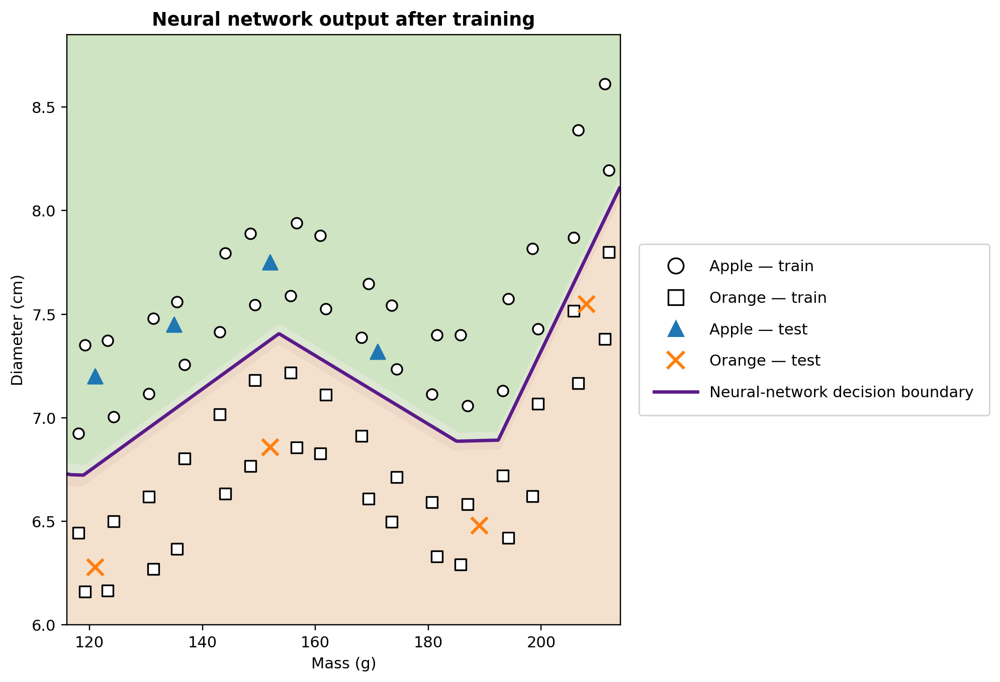

# NeuralMath

**The mathematics behind neural networks — from equations to executable code.**

[](https://neuralmath.org)
[](https://creativecommons.org/licenses/by/4.0/)
[](https://www.python.org/)
[](https://orcid.org/0000-0002-8342-0363)

**NeuralMath** is an open educational project developed by Dr. Americo Cunha Jr. Its goal is to make the mathematical operations inside a small neural network visible, inspectable, and reproducible for a large audience with relatively low mathematical training in calculus and statistics. The equations, geometry, learning algorithm, and Python implementation are designed to be read together.

The project combines a rich multilingual web narrative, the complete pedagogical
texts in PDF, reproducible Python/NumPy code, six language-specific executable notebooks, and all
article figures integrated into the website.

**Website:** https://neuralmath.org
**Repository:** https://github.com/americocunhajr/NeuralMath

---

## Citation

Please cite the original pedagogical text in Portuguese rather than the website or a translation.

> Americo Cunha Jr. “A anatomia matemática de uma rede neural.” Manuscript submitted to Professor de Matemática Online (PMO), 2026.

```bibtex
@unpublished{cunha2026anatomia,
  author = {Cunha Jr, Americo},
  title  = {A anatomia matemática de uma rede neural},
  note   = {Manuscript submitted to Professor de Matemática Online (PMO)},
  year   = {2026}
}
```

The bibliographic entry will be updated with volume, pages and DOI after publication.

---

## What this repository contains

NeuralMath is organized around a complete neural-network example implemented
**from scratch with NumPy**. No automatic differentiation and no high-level
machine-learning framework are required to understand the training procedure.

The current computational experiment uses:

- two input variables: fruit mass and diameter;
- 64 synthetic training examples and 8 illustrative test examples;
- one hidden layer with 12 ReLU neurons;
- one sigmoid output neuron;
- 49 trainable parameters;
- quadratic loss;
- explicit backpropagation via the chain rule;
- stochastic gradient descent with shuffled examples;
- a fixed random seed for reproducibility;
- a two-dimensional decision-region visualization.

The data are synthetic and pedagogical, but they are distributed over plausible
mass–diameter ranges. The geometry is intentionally nonlinear so that the hidden
layer is genuinely useful.

<p align="center">
  
</p>

---

<!-- GitHub math note: display equations below use fenced ```math blocks. Avoid \\operatorname because GitHub's Markdown math renderer rejects it. -->

<!-- GitHub math note: display equations below use fenced ```math blocks. For named functions, prefer \\mathrm{...} in this README. -->

## From geometry to a neural network

The pedagogical path begins with a two-dimensional classification problem.
A fruit is represented by

```math
\mathbf{x}
=
\begin{bmatrix}
x_1 \\
x_2
\end{bmatrix},
```

where $x_1$ is mass and $x_2$ is diameter.

A linear classifier evaluates

```math
s = w_1x_1 + w_2x_2 + b.
```

This affine expression is the mathematical core of an artificial neuron. A
nonlinear activation then transforms the score,

```math
\widehat{y} = g(s).
```

By connecting several neurons, the model becomes a composition of functions.
For the computational example,

```math
\mathbf{z}^{(1)} = W^{(1)}\mathbf{x} + \mathbf{b}^{(1)},
\qquad
\mathbf{h} = \mathrm{ReLU}(\mathbf{z}^{(1)}),
```

followed by

```math
z^{(2)} = W^{(2)}\mathbf{h} + b^{(2)},
\qquad
\widehat{y}=\sigma(z^{(2)}).
```

Training adjusts the parameters so as to reduce a loss. For one example,

```math
E = \frac{1}{2}(y-\widehat{y})^2,
```

and the parameters are updated according to

```math
\theta \leftarrow
\theta - \eta\frac{\partial E}{\partial\theta}.
```

The repository implements these derivatives explicitly so that the code mirrors
the mathematics.

---

## Repository structure

```text
NeuralMath/
├── README.md
├── LICENSE
├── WEBSITE_UPDATE_PROMPT.md
├── requirements.txt
├── PythonCodes/
│   ├── rede_neural_do_zero.py
│   └── neural_network_from_scratch.py
├── ColabCodes/
│   ├── NeuralMath_Colab_PT.ipynb
│   ├── NeuralMath_Colab_EN.ipynb
│   ├── NeuralMath_Colab_ES.ipynb
│   ├── NeuralMath_Colab_FR.ipynb
│   ├── NeuralMath_Colab_IT.ipynb
│   ├── NeuralMath_Colab_DE.ipynb
│   └── NeuralMath_Colab.ipynb  # English compatibility alias
└── docs/
    ├── index.html
    ├── pt/  es/  fr/  it/  de/
    ├── assets/
    │   ├── css/
    │   ├── js/
    │   ├── code/
    │   └── img/{en,pt,es,fr,it,de}/
    └── pdf/{en,pt,es,fr,it,de}/
```

The `docs/` directory is published directly by GitHub Pages at
**https://neuralmath.org**; no frontend build step is required.

---

## Website and languages

The website is a **rich continuous pedagogical edition in six languages**. Each
language page follows the complete conceptual path of the article rather than
showing isolated code excerpts:

**problem → numerical representation → linear classifier → artificial neuron →
activation functions → multilayer network → loss and gradients →
backpropagation → NumPy implementation → learned decision boundary**

All seven article figures are embedded in the corresponding translated web
edition. Every language page also provides direct access to its PDF, the GitHub
repository, and the executable Google Colab notebook.

Language selector order: **Português · English · Español · Français · Italiano · Deutsch**.

The mathematical model and computational experiment are shared across languages;
theory, captions, and exposition follow the corresponding manuscript translation.

---

## Running the Python example

Clone the repository:

```bash
git clone https://github.com/americocunhajr/NeuralMath.git
cd NeuralMath
```

Create a virtual environment if desired:

```bash
python -m venv .venv
source .venv/bin/activate
# Windows PowerShell:
# .venv\Scripts\Activate.ps1
```

Install the dependencies:

```bash
pip install -r requirements.txt
```

Run the English version:

```bash
python PythonCodes/neural_network_from_scratch.py
```

or the Portuguese version:

```bash
python PythonCodes/rede_neural_do_zero.py
```

The scripts train the network, print the numerical results, and regenerate the
decision-region figure.

---

## Google Colab

Each language page links to a notebook with instructions in the same language. The Portuguese notebook uses Portuguese identifiers; the other notebooks use English variable and function names while localizing explanations, printed text, and plot labels.

- **Português:** `ColabCodes/NeuralMath_Colab_PT.ipynb`
- **English:** `ColabCodes/NeuralMath_Colab_EN.ipynb`
- **Español:** `ColabCodes/NeuralMath_Colab_ES.ipynb`
- **Français:** `ColabCodes/NeuralMath_Colab_FR.ipynb`
- **Italiano:** `ColabCodes/NeuralMath_Colab_IT.ipynb`
- **Deutsch:** `ColabCodes/NeuralMath_Colab_DE.ipynb`

`ColabCodes/NeuralMath_Colab.ipynb` is retained as a backwards-compatible alias of the English notebook.

---

## Reproducibility

The reference implementation uses a fixed NumPy random generator,

```python
rng = np.random.default_rng(42)
```

and keeps the complete training procedure explicit. Training-set statistics are
used for standardization, and the same deterministic setup is used when the
reference figures are generated.

The project is intended to make numerical experiments inspectable and
reproducible rather than to present the example as a benchmark for statistical
generalization.

---

## Future extensions

The current binary-classification example is the first module of a broader
project. Natural extensions include:

- visualization of training dynamics;
- interactive inspection of hidden neurons;
- gradient checking;
- alternative activation and loss functions;
- multiclass classification and softmax;
- deeper networks;
- optimization methods beyond basic SGD;
- browser-based interactive experiments;
- further pedagogical texts and multilingual editions.

The goal is to preserve the same principle throughout: **the mathematics and the
code should remain close enough that the reader can trace one directly into the
other.**

---

## Author

**Americo Cunha Jr** is a computational scientist working at the interface of
nonlinear dynamics, uncertainty, data-driven modeling, and artificial
intelligence. He completed his doctoral training in Mechanical Engineering at
**PUC-Rio** and **Université Paris-Est**.

NeuralMath is a **personal and independent educational project**.

- Personal page: https://americocunha.org
- ORCID: https://orcid.org/0000-0002-8342-0363
- NeuralMath: https://neuralmath.org

---

## License

Except where explicitly stated otherwise, the original educational content of
NeuralMath is released under the
**Creative Commons Attribution 4.0 International License (CC BY 4.0)**.

<a href="https://creativecommons.org/licenses/by/4.0/">
  
</a>

You may share and adapt the material, including for commercial purposes, as long
as appropriate attribution is provided.

See [`LICENSE.txt`](LICENSE.txt) for the repository-wide licensing notice and
important exceptions. In particular, journal-formatted PDFs or third-party
materials may be governed by separate terms.

---

## Acknowledgment

If you use NeuralMath in a course, lecture, workshop, research project, or
educational resource, citation of the associated pedagogical text is appreciated.
Feedback, corrections, translations, and mathematically motivated extensions are
also welcome.

## Multilingual web edition

NeuralMath.org now provides the full pedagogical exposition, translated article PDF, Figures 1–7, and a language-specific Google Colab notebook in **26 languages**. The Portuguese original remains the bibliographic text cited by every page.

- 🇧🇷 **Português** — `/pt/`
- 🇬🇧 **English** — `/`
- 🇪🇸 **Español** — `/es/`
- 🇫🇷 **Français** — `/fr/`
- 🇮🇹 **Italiano** — `/it/`
- 🇩🇪 **Deutsch** — `/de/`
- 🇸🇦 **العربية** — `/ar/`
- 🇧🇩 **বাংলা** — `/bn/`
- 🇨🇿 **Čeština** — `/cs/`
- 🇬🇷 **Ελληνικά** — `/el/`
- 🇮🇷 **فارسی** — `/fa/`
- 🇮🇳 **हिन्दी** — `/hi/`
- 🇭🇺 **Magyar** — `/hu/`
- 🇮🇩 **Bahasa Indonesia** — `/id/`
- 🇯🇵 **日本語** — `/ja/`
- 🇰🇷 **한국어** — `/ko/`
- 🇳🇱 **Nederlands** — `/nl/`
- 🇵🇱 **Polski** — `/pl/`
- 🇷🇴 **Română** — `/ro/`
- 🇷🇺 **Русский** — `/ru/`
- 🇸🇪 **Svenska** — `/sv/`
- 🇹🇷 **Türkçe** — `/tr/`
- 🇺🇦 **Українська** — `/uk/`
- 🇵🇰 **اردو** — `/ur/`
- 🇻🇳 **Tiếng Việt** — `/vi/`
- 🇨🇳 **中文** — `/zh/`

For every non-Portuguese notebook, variable and function identifiers remain in English while the explanatory notebook text follows the page language.

